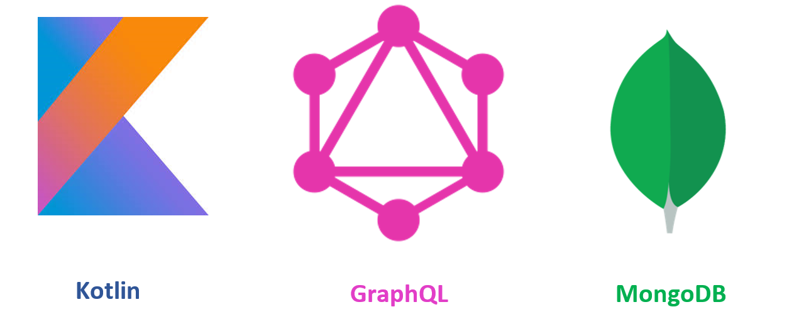
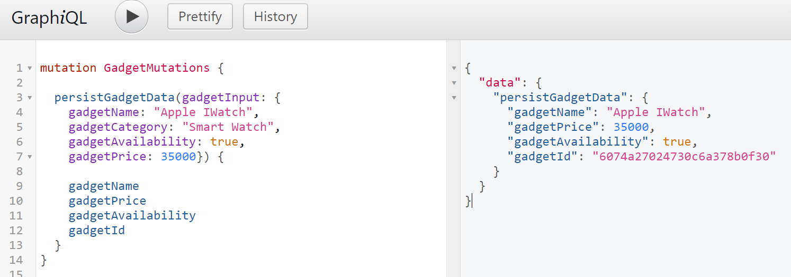
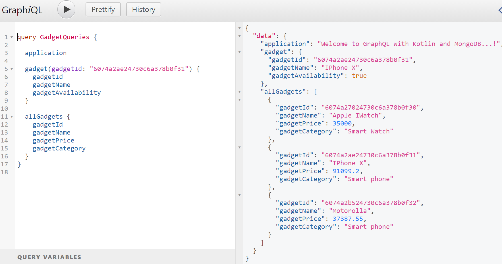
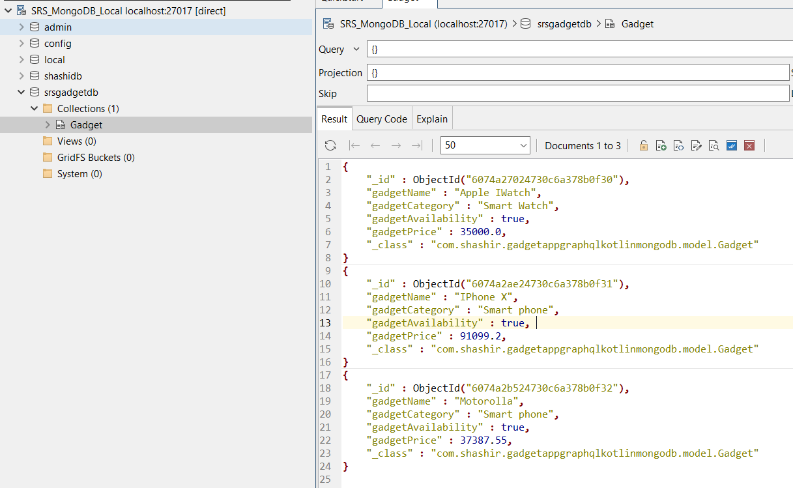

# GraphQL QuickStart with Spring Boot, Kotlin and MongoDB

# Testing Gadget Mutation:

# Testing Gadget Queries:

Verify MongoDB database for Gadget collection, where we can find 3 documents as below:

